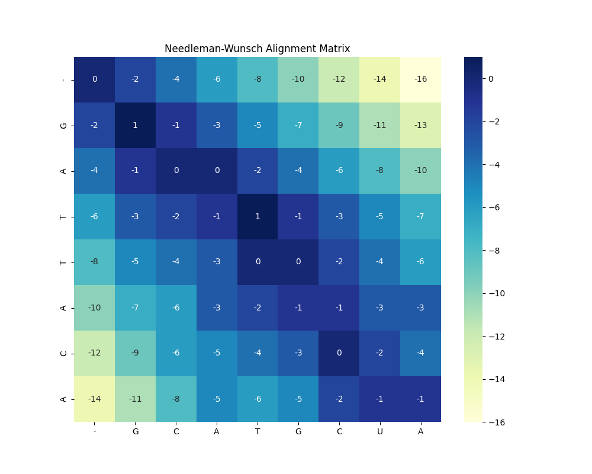

# 🧬 Advanced Bio-Sequence Aligner (Needleman-Wunsch)

### 📊 Project Overview
This project is a high-level implementation of the **Needleman-Wunsch algorithm**, a fundamental pillar of bioinformatics used for global sequence alignment. It allows for comparing two DNA/Protein sequences by finding the optimal alignment through a dynamic programming approach.

### 🧠 How it works (The Logic)
The tool calculates an alignment score by rewarding matches and penalizing mismatches and gaps (indels). It consists of two main phases:
1. **Matrix Scoring:** Building a 2D scoring grid using NumPy.
2. **Traceback:** Reconstructing the best evolutionary path to show exactly where mutations or gaps occurred.

### 🛠 Tech Stack
* **Python 3.x**
* **NumPy:** For high-performance matrix calculations.
* **Seaborn & Matplotlib:** For professional data visualization (Heatmaps).

### 📈 Visual Results
The algorithm generates a **Heatmap** representing the scoring landscape. The dark blue path indicates the most probable evolutionary trajectory between the sequences.

### 🚀 Key Features
* **Customizable Scoring:** Easily adjust match, mismatch, and gap penalties to fit different biological models.
* **Automated Traceback:** Outputs the final aligned sequences with gaps (e.g., `G-ATTACA` vs `GCATGC-A`).
* **Visual Insight:** Immediate feedback through color-coded similarity matrices.

---
*Developed by a Biotechnology enthusiast focusing on Bio-IT and Lab Automation.*
